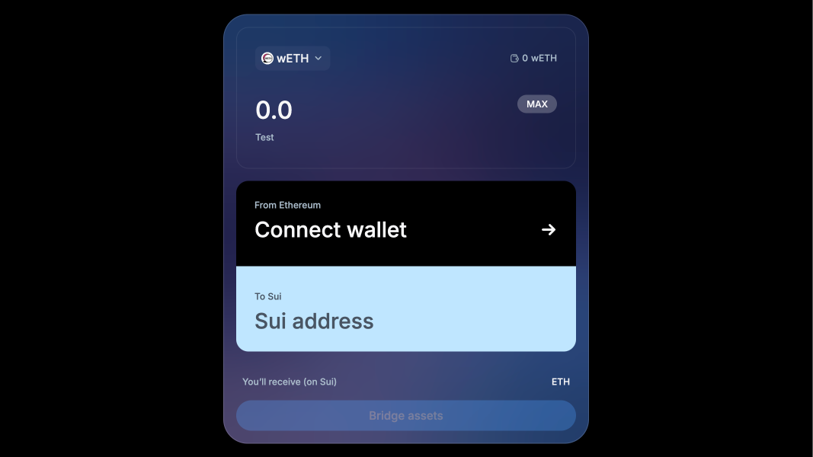

# Native Sui Bridge Widget for React

---

This repository contains React components that allow users to bridge Ethereum and Sui networks. Library is fully typed and self contained.

## Installation

Library is assuming your project is using `react` and `react-dom` as dependencies.

```bash
npm install @aftermath-finance/sui-bridge-react
```

## Usage

Basic standalone usage.

```tsx
import { Bridge, BridgeConfig } from "@aftermath-finance/sui-bridge-react";

const config: BridgeConfig = {
  appKitProjectId: "your-project-id",
  isMainnet: false,
};

export function App() {
  return (
    <>
      <Bridge {...config} />
    </>
  );
}
```

Bridge uses AppKit by Reown (WalletConnect). You have to pass your project ID to the configuration or bridge will not work.

By default, Bridge uses Sepolia. To use it on mainnet, add the following configuration.

```tsx
const config: BridgeConfig = {
  isMainnet: true,
};
```

If your app has already installed `wagmi`, you can pass it's instance.

```tsx
const config: BridgeConfig = {
  wagmi: wagmiInstance,
  queryClient: queryClientInstance,
};
```

### Available tokens

Currently the library supports bridging native ETH and wETH. More tokens might be added in the future.

You can customize the list of available tokens by passing optional `tokenIds` prop. By default all tokens are enabled. Native ETH is always enabled, only ERC20 tokens can be customized. Currently wETH and USDT are supported.

| tokenId | symbol |
| ------- | ------ |
| n/a     | ETH    |
| 2       | wETH   |
| 4       | USDT   |

```tsx
const config: BridgeConfig = {
  tokenIds: [2, 4],
};
```

By passing an empty array, only ETH will be available.

### Customization



This will display the `example.png` image in your documentation.

`BridgeConfig` allows you to remove the background image to make the widget flat. More customization options will be added soon.

```tsx
const config: BridgeConfig = {
  style: {
    hasBackgroundImage: true,
  },
};
```

To customize the widget's theme, you can change root CSS variables. Here is the primary theme.

```css
/* Main */
--primary-color: #4da2ff;
--secondary-color: #1f1f1f;

/* Background */
--background-primary: #030f1c;
--background-secondary: rgba(247 247 248 / 4%);
--background-accent1: #4da2ff;
--background-accent1-hover: #1988ff;
--background-accent2: #c0e6ff;
--background-tertiary: rgba(247 247 248 / 24%);
--background-tertiary-hover: rgba(247 247 248 / 40%);
--background-inverted: #fff;

/* Stroke */
--stroke-primary: rgba(247 247 248 / 8%);
--stroke-secondary: rgba(247 247 248 / 16%);

/* Content */
--content-primary: #f7f7f8;
--content-secondary: #abbdcc;
--content-tertiary: #91a3b1;
--content-inverted: #030f1c;
--content-inverted-secondary: #485563;
--content-negative: #e23c50;

/* Image */
--background-image: url("/background.jpg");

/* Fonts */
--font-family: "Inter", "Roboto", "Helvetica Neue", "Arial Nova", "Nimbus Sans",
  "Arial", sans-serif;

/* Spacing */
--border-radius-base: 16px;
--spacing-base: 16px;
--width: 480px;
--height: 564px;
```

## Development

You can test the library locally using Vite.

```bash
npm run build
npm run dev
```

Testing components is done using storybook.

```bash
npm run storybook
```

## License

Apache-2.0

Developed by [DarkSpace.studio](https://darkspace.studio/) in coordination with Sui Foundation and Mysten. Hosted by Aftermath Finance.
